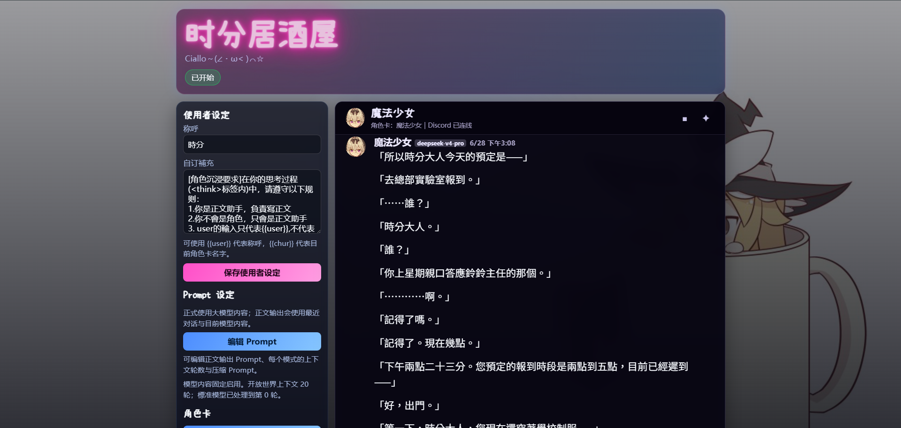
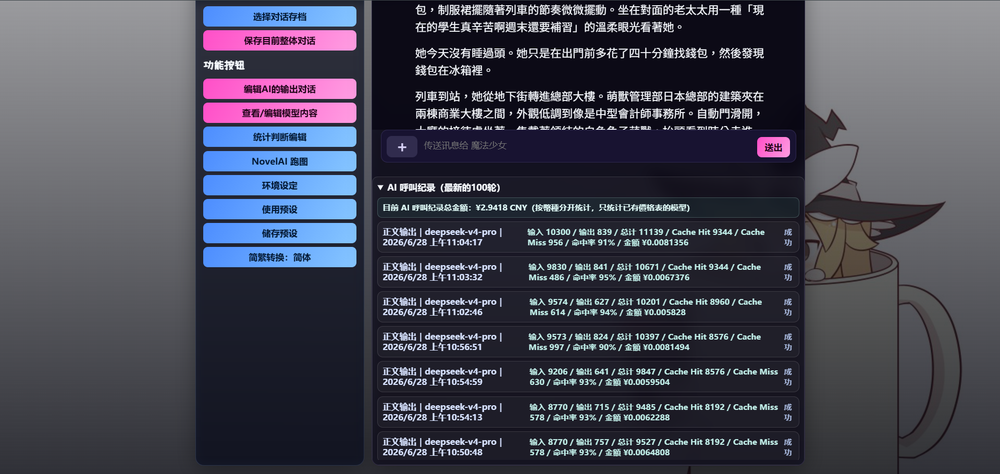
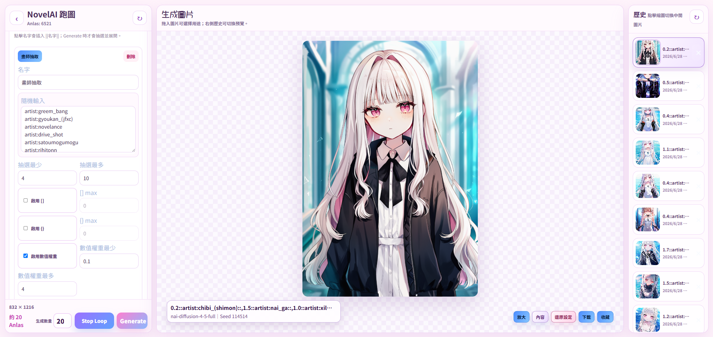
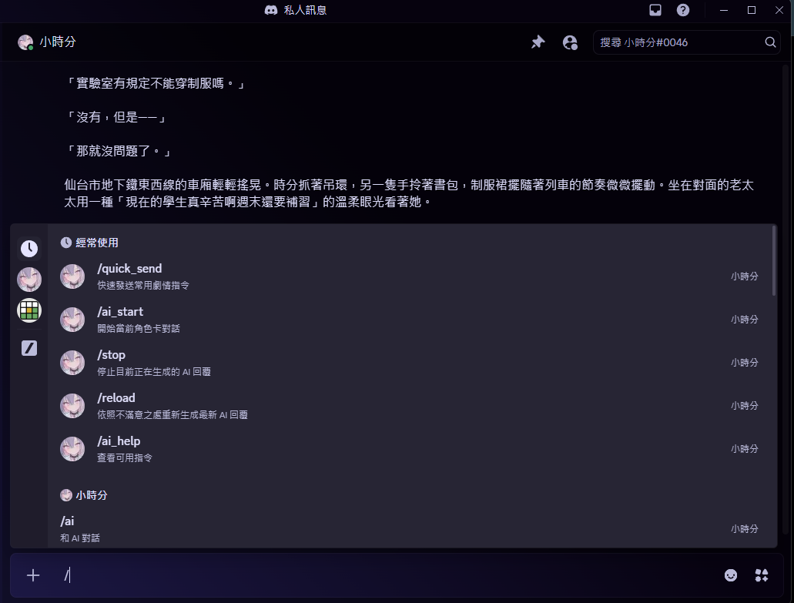

# 時分居酒屋


本地長篇角色對話工具，包含主聊天頁、角色卡與 Prompt 編輯、模型內容管理、Discord Bot，以及 NovelAI 跑圖頁。

## 快速啟動

啟動器需求：

- 第一次啟動可連線至 `nodejs.org` 與 npm registry
- 對話 API key：OpenAI-compatible Chat Completions API
- 選配：Discord Bot Token
- 選配：NovelAI Persistent API Token

`start-mac.command` 與 `start-win.bat` 會檢查 Node.js。系統已有 Node.js `>=18` 與 npm 時直接使用；否則從 Node.js 官方下載最新 Node.js 24.x LTS 到 `.runtime/node/`，驗證 SHA-256 後供此專案使用，不需要管理員權限，也不會修改系統 Node.js。

macOS：

```bash
./start-mac.command
```

Windows：

```bat
start-win.bat
```

手動啟動：

```bash
npm install
cp .env.example .env
npm start
```

手動執行 `npm start` 才需要預先自行安裝 Node.js `>=18` 與 npm。

啟動後打開：

- 主頁：`http://localhost:3234`
- NovelAI：`http://localhost:3234/novelai.html`

`npm start` 會先檢查目前追蹤的 GitHub 分支。工作區沒有程式碼改動且可 fast-forward 時會自動更新；離線、有本機程式碼改動或分支已分岔時會保留現況並繼續啟動。

使用者的角色卡、使用者設定、Prompt、目前對話與本機預設都放在被 Git 忽略的 `data/`，自動更新不會覆蓋。根目錄 `.env` 會自動備份到 `data/environment.env`；新版本缺少 `.env` 時，啟動器會由該備份還原。舊版若曾把「儲存預設」或 Prompt 寫進追蹤檔，更新器會先遷移到 `data/` 再更新程式碼。

若本機程式檔改動使自動更新跳過，手動更新時先停止服務並備份整個 `data/`，取得乾淨的新版本後，只把備份的 `data/` 放回新版本再啟動。不要用舊程式檔覆蓋新版本。`data/environment.env` 含 Token 與 API Key，請勿分享或提交。

這個檢查只在每次 `npm start` 啟動時執行一次，不會中斷正在運行的 server 做熱更新。每台 server 都需要以 `npm start` 重啟才會拉取；直接執行 `node src/index.js` 會略過更新流程。需要暫時關閉時可在 `.env` 設定：

```env
TIME_TAVERN_AUTO_UPDATE=0
```

## 最少設定

`.env` 至少填對話 API：

```env
CHAT_API_PROVIDER=deepseek
CHAT_API_KEY=你的_API_Key
CHAT_API_MODEL=deepseek-v4-pro
```

也可把 provider 改為 `zhipu` 並選用 `glm-5.3` 或原生多模態的 `glm-5.3-flash`；系統始終使用 `CHAT_API_MODEL` 指定的模型，不會因上傳圖片自動換模型。完整 provider 設定見 [細節文件](docs/DETAILS.md)。

NovelAI 圖片功能另外填：

```env
NOVELAI_API_TOKEN=你的_NovelAI_Persistent_API_Token
```

保存環境設定時，只有 `NOVELAI_API_TOKEN` 在空白與有值之間切換，系統才會自動停用或啟用所有 Prompt 跑圖觸發組合。Token 狀態沒有改變時，保留使用者在 Prompt 內手動調整的啟用狀態。

Discord 不填 `DISCORD_BOT_TOKEN` 也能正常使用本地網頁。
設定 `DISCORD_ALLOWED_USER_ID` 後，Bot 只接受該 Discord 使用者的指令、訊息、編輯與反應。
`DISCORD_BOT_TOKEN`、`DISCORD_CLIENT_ID` 與 `DISCORD_ALLOWED_USER_ID` 只保留在本機 `.env`，不會寫入作者預設。

## 第一次啟動預設

第一次啟動時，後端會把發布用的 `defaults/app-defaults.json` 複製成 `data/app-defaults.json`。如果沒有 `data/app-state.json`，再以這份本機預設建立目前狀態。

目前發布預設包含 22 張角色卡、2 個助手與 5 種 Prompt 模式，其中包含「跑圖卡」的跑圖不跑正文設定。

NovelAI 同樣把 `defaults/novelai-defaults.json` 複製成 `data/novelai-defaults.json`；瀏覽器沒有本頁 draft 時會讀取本機 NovelAI 預設。

`start-mac.command` 與 `start-win.bat` 會自動準備缺少的專案 Node.js、安裝缺少的 `node_modules`、執行 `npm start`，並在更新及伺服器啟動完成後依目前 `PORT` 開啟瀏覽器。預設套用由 server 與 NovelAI 前端完成，啟動器不需要額外呼叫套用 API。

服務已在運行時若更新到後端程式，請使用環境設定中的「重啟伺服器」或重新執行啟動器；只刷新網頁只會重新載入前端檔案。

主頁「其他 → 預設」中的「儲存預設」只寫入本機預設；「使用預設」才會套用；「使用作者預設」會以目前程式版本隨附的作者預設替換本機預設，但不會立即修改正在使用的角色卡、Prompt 或目前對話。

## 功能

主頁：

- 角色卡與助手：建立、編輯、裁切封面、世界書、開場對話、匯入/匯出角色卡，並可建立獨立 Prompt 助手。
- Prompt 編輯：角色模式、正文規則、大模型、模塊、觸發條件、並行跑圖與追加詞。
- 模型內容：查看、保存、匯出標準壓縮模型與自訂大模型內容。
- 對話：串流生成、圖片輸入、停止、改寫較早輸入、訊息編輯重算、分離式存檔與載入、去重 AI 呼叫紀錄。
- 時間統計：天數、日期、早中晚、關鍵字與自動切換。
- 其他：預設、簡繁轉換、問題反映，以及 NovelAI 跑圖與 Storyboard 入口。

NovelAI：

- 支援 NAI Diffusion V5、V4.5、V4 與 V3，並提供常用生成參數、Prompt 片段與參考圖功能。
- 支援連續生成、圖片設定匯入、下載、收藏、本地歷史與放大檢視。
- 支援 NovelAI 預設的保存與啟用。
- 純靜態版本：<https://nightsay2002.github.io/novelai-image-static/>；Token 與圖片只保存在使用者瀏覽器。

Discord：

- 六個 Slash 指令：`/ai_start`、`/ai_status`、`/stop`、`/player_set`、`/reload`、`/quick_send`。
- 支援頻道與私訊直接對話、文字／圖片附件、角色卡瀏覽、多玩家座位、訊息重算與反應回饋。

## 預覽









## 主要檔案

```text
src/index.js                 HTTP API、狀態、Prompt、Discord、NovelAI proxy
src/public/index.html        主頁
src/public/app.js            主頁互動
src/public/novelai.html      NovelAI 頁
src/public/novelai.js        NovelAI 互動
src/public/styles.css        共用樣式
defaults/app-defaults.json     發布用主功能與 Prompt 預設
defaults/novelai-defaults.json 發布用 NovelAI 預設
scripts/bootstrap-node-mac.sh   macOS 專案 Node.js 安裝器
scripts/bootstrap-node-win.ps1  Windows 專案 Node.js 安裝器
data/app-defaults.json         使用者本機主功能與 Prompt 預設
data/novelai-defaults.json     使用者本機 NovelAI 預設
data/environment.env           根目錄 .env 的本機備份
data/                          角色卡、設定、對話與其他本機資料，不要提交
```

## 更多細節

完整環境變數、Discord 指令、API、資料檔與功能細節見：

[docs/DETAILS.md](docs/DETAILS.md)

## 檢查

```bash
npm test
node --check src/index.js
node --check src/public/app.js
node --check src/public/novelai.js
```

`npm test` 使用本地模擬對話驗證 20 輪正文上下文：第 21 回合先觸發標準壓縮，再送出角色卡、壓縮內容、第 20 回合橋接與本次 user；測試不會呼叫外部模型 API。
